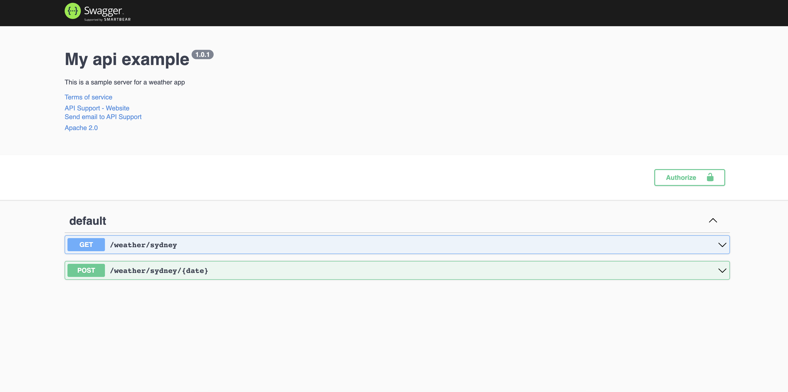

Dev Notes:

----------

npm init -y

npm i express

npm i --save-dev nodemon

nodemon server.js

npm i fast-csv

----------

npm i --save-dev jasmine

npx jasmine init

"scripts": { "test": "jasmine" }

npm i --save-dev request

npm i --save-dev moment

npm test

----------

npm i swagger-jsdoc swagger-ui-express

https://swagger.io/specification/#infoObject

http://localhost:1234/swagger/